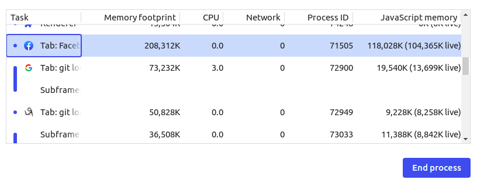

### fork wait 僵尸进程
实验证明,Linux下若父进程没有wait子进程,默认会将子进程全部杀掉

### js有GC也能造成 memory leak
- 无限滚动列表,没有做虚拟dom,导致页面产生太多DOM节点,会造成内存性能问题
- document.createElemnt没有加入DOM,也没有删除他们,也会占用内存
- 引用可达就不会被GC

GC不能解决所有的 memory leak问题  
Chrome浏览器自带一个task Manager,可以监控很多信息.

