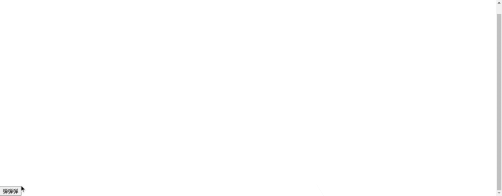

### 一个简单的侧边栏

```css
.box {
    height: 100vh;
    width: 280px;
    position: absolute;
    visibility: hidden;
    background-color: aqua;
    transform: translateX(-280px);
    -webkit-transition: transform .25s cubic-bezier(0.4, 0.0, 0.2, 1), visibility linear .25s;
    transition: transform .25s cubic-bezier(0.4, 0.0, 0.2, 1), visibility linear .25s;
}
.show {
    transform: translateX(0);
    visibility: visible;
}
```
昨日过于劳累.今天就不干啥事了

