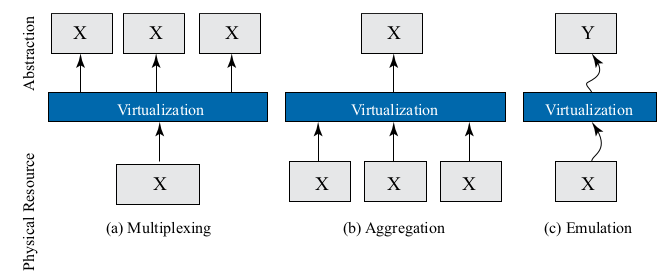

### 三种virtualization
- 一个资源虚拟成多个
- 多个资源虚拟成一个
- A虚拟成B

### Popek/Goldberg Theorem 
满足以下两个条件的处理器可以实现Hypervisor，不用修改guest OS
- 具有特权模式和普通模式
- 具有分段机制的虚拟内存

### 参考
Formal Requirements for Virtualizable Third Generation Architectures Gerald J. Popek,Robert P. Goldberg Honeywell Information Systems and Harvard University 1974